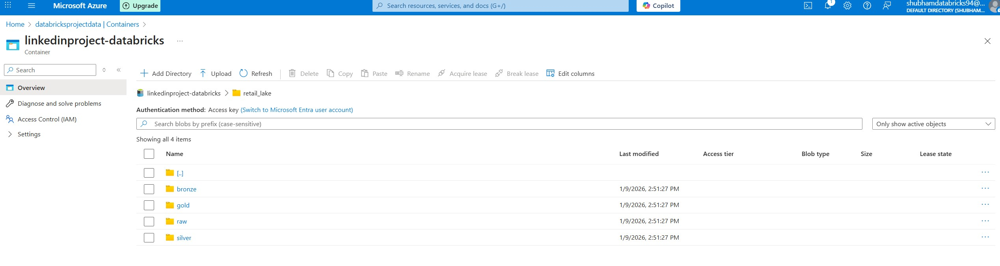
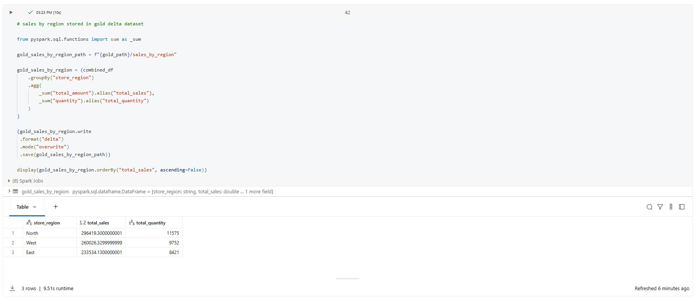
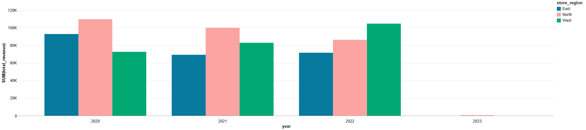
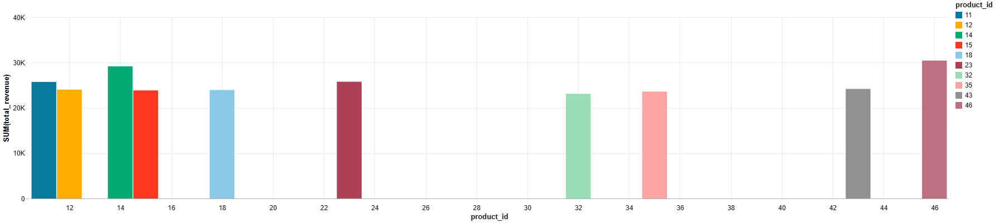
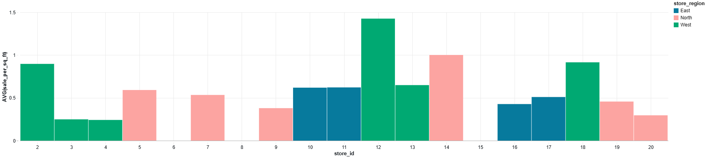
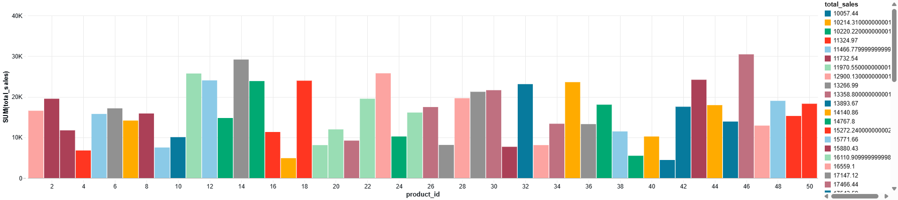

# Retail Sales Analysis using Azure Databricks & Spark SQL

## Project Overview
This project analyzes multi-year retail sales data to uncover revenue trends, store efficiency, and product performance. The analysis was performed using Azure Databricks and Spark SQL to simulate large-scale data processing and analytics. Dashboards created in Databricks SQL for interactive analysis.

---

## Objectives
- Clean and integrate raw sales and store datasets
- Analyze revenue trends using Year-on-Year (YoY) growth
- Measure store efficiency using Sales per Square Foot
- Identify top-performing products, stores, and regions
- Evaluate the relationship between store size and revenue

---

## Dataset Description
The project uses two datasets:
- **sales**: Transaction-level sales data
- **store**: Store metadata including region and store size

The datasets were cleaned and combined using **INNER JOINs** in Spark SQL.

---

## Tools & Technologies
- Azure Databricks
- Spark SQL
- Window Functions (LAG)
- Data Cleaning & Aggregation
- KPI-based Analysis
- Databricks Visualizations

---

## Key Metrics
- Total Revenue
- Year-on-Year (YoY) Revenue Growth
- Sales per Square Foot
- Average Sales by Store Size Bucket
- Product-wise Revenue and Quantity Sold

---

## Key Findings
- Revenue declined in 2021 and recovered in 2022.
- North region generated the highest total revenue.
- West region stores showed the highest efficiency (sales per sq. ft).
- Medium-sized stores outperformed large stores in average revenue.
- High-revenue products are not always the most sold by quantity.

---

## Data Lake Structure (ADLS Gen2)

The project follows a Medallion Architecture using Azure Data Lake Storage:

- raw: source files (CSV)
- bronze: cleaned Delta tables
- silver: joined & validated datasets
- gold: analytics-ready aggregates

---

## Gold Layer – Sales by Region

This Gold table aggregates total sales and quantity by store region,
making it analytics- and BI-ready. Insights: North region has the highest total sales, 
followed by West and East, indicating stronger store performance in northern markets.

---

## Key Visualizations

### Year wise sales per region

### Top 10 Products by Revenue

### Sales per Square Foot by Region

### Product wise revenue

---

## Conclusion
This project demonstrates how analytical KPIs and scalable data tools can be used to extract actionable insights from retail datasets, supporting data-driven decision-making.

---
